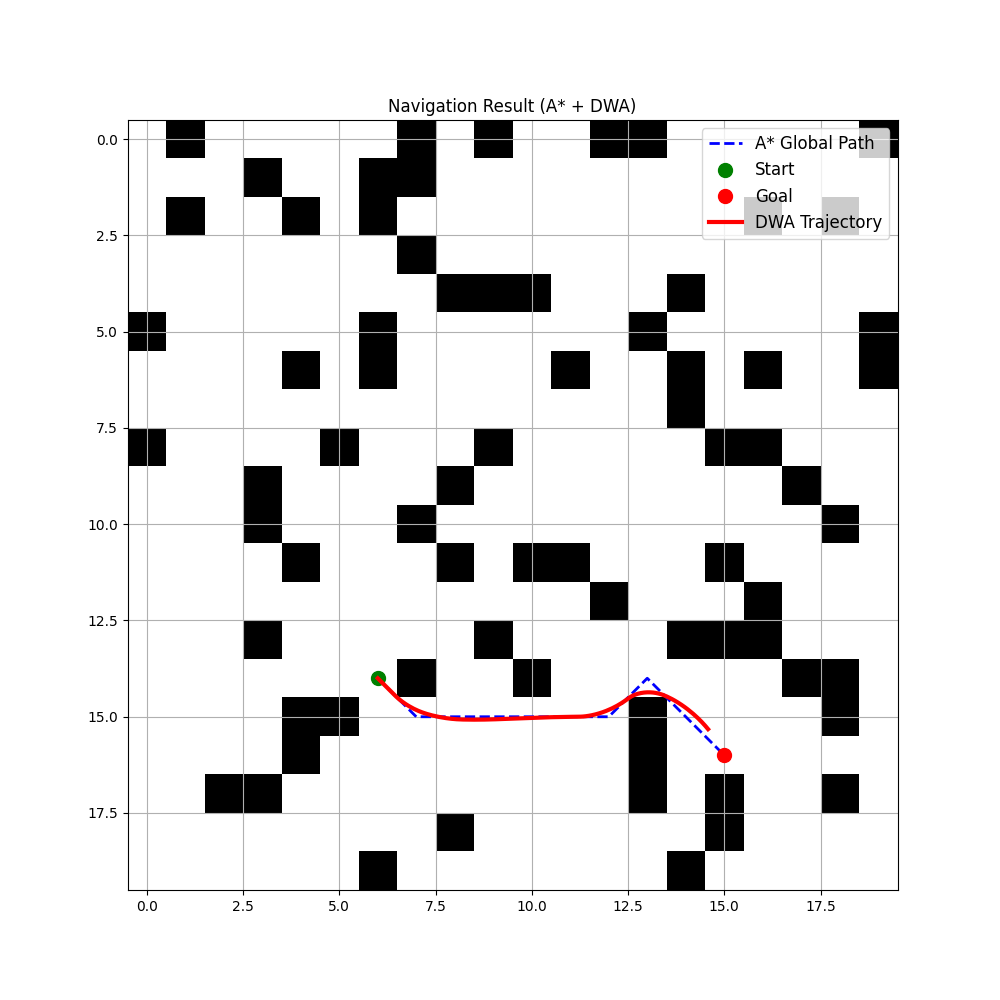

# Navigation Framework

An intelligent autonomous navigation system for a mobile robot moving through a
partially known, cluttered 2-D environment. The robot plans a route from a start
to a goal, then follows it while continuously reacting to obstacles under motion
constraints.

The project is built around a deliberate separation between **global planning**
(finding a route) and **local optimization** (following it safely), layered on
top of a **probabilistic representation** of the world. Every core algorithm —
A*, the local planners, the risk field, and the Gaussian blur behind it — is
implemented from scratch; NumPy and Matplotlib are used only for array math and
plotting.



*A representative run. Left: binary occupancy grid. Right: probabilistic risk
field (green = safe, red = high risk). Dashed blue is the A\* global path; solid
red is the executed MPPI trajectory, threading the clutter while staying in the
low-risk band and rounding corners smoothly.*

---

## Why two planners?

A single algorithm cannot do both jobs well:

- **Global planning (A\*)** sees the whole map and guarantees a route to the
  goal exists, but it is blind to the robot's dynamics — it produces a sequence
  of grid cells, not drivable motion.
- **Local optimization (MPPI / DWA)** respects the robot's velocity and
  acceleration limits and reacts to nearby obstacles, but it is short-sighted:
  on its own it walks straight into dead ends and gets trapped in local minima.

Combining them gives the strengths of both — the global path keeps the local
planner out of dead ends, and the local planner turns an abstract path into safe,
feasible motion. This interplay between **search** and **optimization** is the
central idea of the project.

---

## What it does

| Requirement | How it is addressed |
|---|---|
| **Global planning** | Manual **A\*** on an occupancy grid (`src/a_star.py`) with an admissible Euclidean heuristic and corner-safe 8-connectivity. |
| **Local optimization** | **MPPI** (Model Predictive Path Integral) sampling-based optimal control (`src/mppi.py`), with a classic **DWA** implementation (`src/dwa.py`) kept as a baseline. |
| **Score/cost function** | Multi-term objective `G = heading + obstacle + velocity + goal + smoothness + path-deviation`, normalised and weighted. |
| **Option C — Probabilistic mapping** | Gaussian risk field over the grid modelling obstacle uncertainty (`src/prob_map.py`); drives both collision-checking and the smooth obstacle cost. |
| **Option D — Multi-objective optimization** | Simultaneous optimisation of progress, safety, speed, smoothness, and path consistency. |
| **Experimental evaluation** | Seeded, reproducible MPPI-vs-DWA benchmark (`experiments/benchmark.py`). |
| **Visualization** | Two-panel figure of the grid, risk field, global path, and executed trajectory (`utils/visualisation.py`). |

Two of the four optional extensions (C and D) are implemented; only one was required.

---

## How it works

**1. Environment representation.** A random binary occupancy grid is generated,
then a `ProbabilisticMap` blurs it with a from-scratch separable Gaussian kernel.
Instead of hard obstacle/free cells, every cell holds a **risk value in [0, 1]**.
This single representation serves three purposes: it inflates obstacles so the
global path keeps clearance, it provides a smooth (differentiable) obstacle cost
for the local planner, and it defines a collision threshold for safety checks.

**2. Global planning.** A* runs on the *inflated* planning grid — the set of
cells whose risk exceeds the collision threshold. Planning on the same grid the
local planner considers lethal guarantees the global route only uses corridors
the robot can actually follow, eliminating a whole class of "path exists but robot
gets stuck" failures.

**3. Local optimization.** The robot follows the path using a **pure-pursuit
lookahead** ("carrot") target for stability. At each step the local planner:

- **MPPI** samples hundreds of full control *sequences*, rolls each one forward
  through the differential-drive model, scores them with the multi-objective
  cost, and combines them with a softmin (path-integral) weighting. Because each
  rollout can bend and turn along the horizon, MPPI represents manoeuvres like
  "turn, then go straight" that DWA structurally cannot. The nominal control
  sequence is warm-started between steps (receding horizon) for smooth commands.
- **DWA** (baseline) exhaustively searches the dynamic window of admissible
  `(v, ω)` pairs, but evaluates only a single *constant* command per candidate —
  so every predicted trajectory is a circular arc.

**4. Adaptation.** The system re-plans its motion at every control step against
the current risk field and re-selects its lookahead target, so it continuously
adapts as it advances.

---

## Project structure

```
navigation-framework/
├── main.py                  # End-to-end demo: map → A* → local planner → figure
├── requirements.txt
├── src/
│   ├── a_star.py            # A* global planner
│   ├── dwa.py               # Dynamic Window Approach (baseline local planner)
│   ├── mppi.py              # MPPI local planner (primary)
│   ├── prob_map.py          # Probabilistic occupancy / risk map (Option C)
│   └── navigation.py        # Global-path-following loop with pure-pursuit lookahead
├── utils/
│   ├── map_generator.py     # Random occupancy-grid generation
│   ├── nodes.py             # A* node helper
│   ├── pathfinding.py       # A* heuristic, neighbours, path reconstruction
│   └── visualisation.py     # Matplotlib rendering of grid, risk field, trajectory
├── experiments/
│   ├── benchmark.py         # Reproducible MPPI-vs-DWA evaluation
│   └── dwa_result.png       # Saved demo figure
└── report/                  # LaTeX technical report
```

---

## Getting started

```bash
# 1. (optional) create a virtual environment
python -m venv .venv
source .venv/Scripts/activate      # Windows (Git Bash);  use .venv/bin/activate on Linux/macOS

# 2. install dependencies
pip install -r requirements.txt

# 3. run the end-to-end demo (saves experiments/dwa_result.png)
python main.py
```

To switch the local planner from MPPI to the DWA baseline, set `PLANNER = "dwa"`
near the top of `main.py`.

### Reproducing the benchmark

```bash
python -m experiments.benchmark                 # default: 25 maps
python -m experiments.benchmark --maps 25 --min-path 8
```

The run is fully seeded, so the numbers below are reproducible.

---

## Results

Over 25 seeded, non-trivial 20×20 maps at 30 % obstacle density (600-step budget),
both planners using the identical A* path and probabilistic cost — only the
optimiser differs:

| Local planner | Reached goal | Avg. steps (successful) |
|---|---|---|
| **MPPI** (chosen) | **17 / 25 (68 %)** | 208 |
| DWA (baseline) | 0 / 25 (0 %) | — |

DWA stalls because from a standstill its acceleration-limited window admits only
near-zero speeds and every candidate is a single arc — it cannot express the
"pivot then advance" motion that clutter demands. MPPI's sequence-level sampling
escapes exactly those traps, which is why it is the primary method.

---

## Design notes & reflection

- **Where does the intelligence come from?** Not from any single algorithm but
  from their *composition*: search (A\*) supplies global foresight, optimization
  (MPPI) supplies feasible, reactive motion, and the probabilistic representation
  couples them so that "safe for the global planner" and "safe for the local
  planner" mean the same thing.
- **Weighting trade-offs.** Raising the obstacle weight widens clearance but
  slows the robot and can freeze it in tight passages; raising the velocity/goal
  weights speeds it up at the cost of closer, riskier passes — a concrete
  speed/safety/efficiency trade-off that the cost weights expose directly.
- **Known limitations.** The world is static and fully revealed at planning time
  (no online sensing or moving obstacles); MPPI is stochastic, so success is a
  rate rather than a guarantee; and very high obstacle densities can leave no
  clearance-respecting corridor at all. Natural next steps are dynamic obstacles,
  online re-planning when the risk field changes, and a learned cost term
  (Option A).

A full write-up — problem framing, architecture, method details, experiments, and
failure-case analysis — is in the **[technical report](report/main.pdf)**
(LaTeX sources under `report/`).

---

## License

See [LICENSE](LICENSE).
